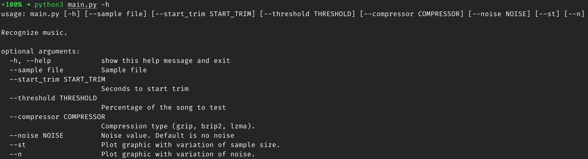

# TAI - Lab work 3

The objective is to use the Normalized Compression Distance (NCD), with multiple compressors, in order to obtain the similarity between a small music sample and every complete music in the dataset. The sample will then be assigned to the one which has the smaller average distance for all the compressors.

Both the report and the video presentation are in the root folder, called "report.pdf" and "presentation.mp4".

## Authors

* [Bruno Bastos](https://github.com/BrunosBastos) - 93302
* [Eduardo Santos](https://github.com/eduardosantoshf) - 93107
* [Pedro bastos](https://github.com/bastos-01) - 93150

### How to run

#### main.py

Main program to use.

Example:
	
	$ python3 main.py --sample examples/sample01.wav --threshold 50 --compressor lzma --noise 0.1

#### tests.py

Program to plot graphics on precision.

	$ python3 tests.py

